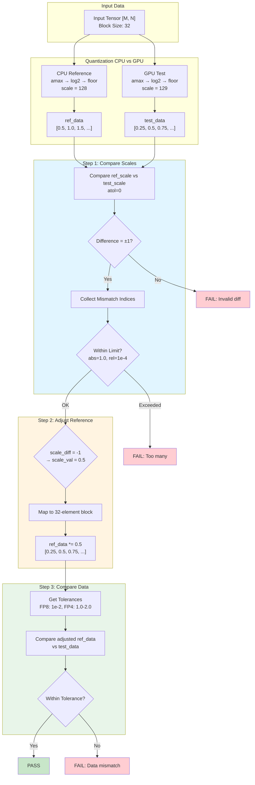

# E8M0 Scale Tolerance Adjustment Visualization

## Interactive Flow Diagram



## Data Flow Diagram

```
┌─────────────────────────────────────────────────────────────────────────┐
│                         INPUT DATA                                       │
├─────────────────────────────────────────────────────────────────────────┤
│  Input Tensor: [M, N] (e.g., [128, 1024])                              │
│  Block Size: 32 elements per scale                                      │
└─────────────────────────────────────────────────────────────────────────┘
                              │
                              ▼
┌─────────────────────────────────────────────────────────────────────────┐
│                    QUANTIZATION (CPU vs GPU)                             │
├─────────────────────────────────────────────────────────────────────────┤
│                                                                          │
│  CPU Reference:                    GPU Test:                            │
│  ┌──────────────┐                  ┌──────────────┐                     │
│  │ amax = 3.14  │                  │ amax = 3.14  │                     │
│  │ log2 = 1.65  │                  │ log2 = 1.65  │                     │
│  │ floor = 1    │                  │ floor = 1    │  ← May differ!      │
│  │ scale = 128  │                  │ scale = 129  │  ← ±1 difference    │
│  └──────────────┘                  └──────────────┘                     │
│                                                                          │
│  Quantized Data:                 Quantized Data:                         │
│  ┌──────────────┐                  ┌──────────────┐                     │
│  │ [0.5, 1.0,   │                  │ [0.25, 0.5,  │                     │
│  │  1.5, 2.0,   │                  │  0.75, 1.0,  │                     │
│  │  ...]        │                  │  ...]        │                     │
│  └──────────────┘                  └──────────────┘                     │
│      32 elements                        32 elements                      │
└─────────────────────────────────────────────────────────────────────────┘
                              │
                              ▼
┌─────────────────────────────────────────────────────────────────────────┐
│                    STEP 1: Compare E8M0 Scales                          │
├─────────────────────────────────────────────────────────────────────────┤
│                                                                          │
│  ref_scale[i] = 128    test_scale[i] = 129                              │
│  │                    │                                                 │
│  │                    │                                                 │
│  ▼                    ▼                                                 │
│  ┌─────────────────────────────────────┐                                │
│  │ |128 - 129| = 1 > atol(0)          │                                │
│  │ → MISMATCH DETECTED                 │                                │
│  │ → Store index i in mismatch_indices │                                │
│  └─────────────────────────────────────┘                                │
│                                                                          │
│  Check: mismatches_num <= limit (1.0 absolute or 1e-4 relative)        │
└─────────────────────────────────────────────────────────────────────────┘
                              │
                              ▼
┌─────────────────────────────────────────────────────────────────────────┐
│                    STEP 2: Adjust Reference Data                        │
├─────────────────────────────────────────────────────────────────────────┤
│                                                                          │
│  For mismatch at index i:                                                │
│                                                                          │
│  scale_diff = ref_scale[i] - test_scale[i] = 128 - 129 = -1            │
│                                                                          │
│  ┌─────────────────────────────────────┐                                │
│  │ scale_diff = -1                     │                                │
│  │ → scale_val = 0.5                   │                                │
│  └─────────────────────────────────────┘                                │
│                    │                                                     │
│                    ▼                                                     │
│  ┌─────────────────────────────────────┐                                │
│  │ Map scale index i to data block:    │                                │
│  │   row_block = i / stride            │                                │
│  │   col_block = i % stride            │                                │
│  │   → Covers 32 elements              │                                │
│  └─────────────────────────────────────┘                                │
│                    │                                                     │
│                    ▼                                                     │
│  ┌─────────────────────────────────────┐                                │
│  │ BEFORE ADJUSTMENT:                  │                                │
│  │ ref_data = [0.5, 1.0, 1.5, 2.0,    │                                │
│  │              ... 32 elements]       │                                │
│  └─────────────────────────────────────┘                                │
│                    │                                                     │
│                    ▼                                                     │
│  ┌─────────────────────────────────────┐                                │
│  │ AFTER ADJUSTMENT:                    │                                │
│  │ ref_data *= 0.5                      │                                │
│  │ ref_data = [0.25, 0.5, 0.75, 1.0,   │                                │
│  │              ... 32 elements]        │                                │
│  └─────────────────────────────────────┘                                │
│                                                                          │
│  Now ref_data matches test_data's quantization scale!                   │
└─────────────────────────────────────────────────────────────────────────┘
                              │
                              ▼
┌─────────────────────────────────────────────────────────────────────────┐
│                    STEP 3: Compare Quantized Data                       │
├─────────────────────────────────────────────────────────────────────────┤
│                                                                          │
│  Adjusted ref_data:          test_data:                                  │
│  ┌──────────────┐            ┌──────────────┐                            │
│  │ [0.25, 0.5,  │            │ [0.25, 0.5,  │                            │
│  │  0.75, 1.0,  │            │  0.75, 1.0,  │                            │
│  │  ...]        │            │  ...]        │                            │
│  └──────────────┘            └──────────────┘                            │
│                                                                          │
│  ┌─────────────────────────────────────┐                                │
│  │ Compare with tolerances:            │                                │
│  │   FP8: atol=1e-2, rtol=1e-2        │                                │
│  │   FP4: atol≈1.0-2.0                 │                                │
│  │                                     │                                │
│  │ Differences now reflect:            │                                │
│  │   ✓ Quantization granularity        │                                │
│  │   ✗ NOT scale computation errors    │                                │
│  └─────────────────────────────────────┘                                │
│                                                                          │
│  Result: PASS (differences within tolerance)                             │
└─────────────────────────────────────────────────────────────────────────┘
```

## Mathematical Relationship

```
Scale Difference → Data Adjustment Factor:
─────────────────────────────────────────
ref_scale - test_scale = +1  →  scale_val = 2.0   (ref was 2x larger)
ref_scale - test_scale = -1  →  scale_val = 0.5   (ref was 0.5x smaller)
ref_scale - test_scale = 0   →  scale_val = 1.0   (no adjustment needed)

Quantization Relationship:
──────────────────────────
scale_e8m0 = floor(log2(amax)) - 2 + 127
quant_scale = 2^(-(scale_e8m0 - 127))
qdata = input * quant_scale

If scale differs by ±1:
  quant_scale_test = quant_scale_ref × 2^(±1)
  qdata_test = qdata_ref × 2^(±1)
  
Therefore: qdata_ref_adjusted = qdata_ref × 2^(±1) = qdata_test
```

## Block Mapping (Rowwise Example)

```
Scale Array: [M/32, N/32]          Data Array: [M, N]
┌─────────────┐                    ┌─────────────────┐
│ scale[0,0]  │ ────────covers───▶ │ row 0: 32 elems │
│ scale[0,1]  │ ────────covers───▶ │ row 0: next 32  │
│ scale[1,0]  │ ────────covers───▶ │ row 1: 32 elems │
│    ...      │                    │      ...         │
└─────────────┘                    └─────────────────┘

Each scale[i,j] covers:
  - Rowwise: 1 row × 32 columns
  - Colwise: 32 rows × 1 column
```

